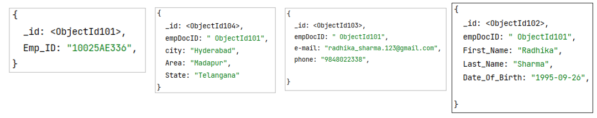

## What is MongoDB: MongoDB is a cross-platform, document oriented database.

- Provides high performance 
- High availability 
- Easy scalability 
- It is no SQL  
- written in C++

## MongoDB can manage:
- Structured data 
- Semi structured data 
- Un structured data 

## NoSQL Databases:  
NoSQL Database is used to refer a non-SQL or non-relational database.

- No table 
- No row 
- No complex join 

## NoSQL Behind History:

- In the early 1970, Flat File Systems are used, that time there was no standard, no format difficult to manage and share. 
- In 1970 Computer scientist Edgar F. Codd proposed a database model to resolve this problem, known as relational database model 
- But later relational database also get a problem that it could not handle big data, due to this problem there was a need of database which can handle every types of problems. 
- The initial development of NoSQL database MongoDB began in 2007 by 10gen, the the company name changed with new name MongoDB Inc. 
- Later in 2009, it is introduced in the market as an open source database server
- The first ready production of MongoDB has been considered from version 1.4 which was released in March 2010.


## Basic Terminology
|     RDBMS          	|     MongoDB                                                       	|
|--------------------	|-------------------------------------------------------------------	|
|     Database       	|     Database                                                      	|
|     Table          	|     Collection                                                    	|
|     Tuple/Row      	|     Document                                                      	|
|     column         	|     Field                                                         	|
|     Table Join     	|     Embedded Documents                                            	|
|     Primary Key    	|     Primary Key (Default key _id provided   by MongoDB itself)    	|

## Sample Code 
```javascript
{
	_id: Objectld(7df78ad8902c) 
	title: 'value', 
	tags: ['value','value','value'],
	likes: 100, 
	comments: [
		{
			user: 'value' , 
			message: 'value', 
			dateCreated: new Date(2011,1,20,2,15), 
			like:0
		},
		{
			user: 'value' , 
			message: 'value' , 
			datecreated: new Date(2011,1,25,7,45),
			like:5
		}
	]
}
```
**Default key _id Definition:** _id is a 12 bytes hexadecimal number

| <font style="color:red">7df7</font> 	| <font style="color:green">8ad</font>  	| <font style="color:blue">89</font> 	| <font style="color:white">02c</font> 	|
|------	|------	|----	|-----	|
- First 4 bytes = current timestamp
- Next 3 bytes = machine id
- Next 2 bytes = process id
- Last 3 bytes = incremental VALUE

## Advantages
- Schema less
- single object
- No complex joins
- Deep query-ability
- Tuning
- Ease of scale-out
- Uses internal memory for storing

## Where to use MongoDB?
- Big Data
- Content Management and Delivery
- Mobile and Social Infrastructure
- User Data Management
- Data Hub

## MongoDB Edition
- MongoDB Community Server
- MongoDB Enterprise Server
- MongoDB Atlas

## Install MongoDB
- Download MongoDB Community Server
- Install MongoDB Community Server on the local machine
- Download MongoDB Compass
- Install MongoDB Compass
- Connect MongoDB With Compass Application

## MongoDB - Data Modeling:
MongoDB provides two types of data models
- Embedded Data Model
- Normalized Data Model

## Embeded Data Model
In this model, you can have (embed) all the related data in a single document, it is also known as de-normalized data model.

```javascript
{
	_id: ,
	Emp_ID: "10025AE556" 
	Personal_details : { 
		First_Name: "Radhika" , 
		Last_Name: "Sharma" , 
		Date_Of_Birth:"1995-09-26" 
	},
	Contact: { 
		e-mail: "radhika_sharma.123@gmail.com",
		phone : "9848622358",
	},
	Address:{
	city : "Hyderabad" , 
	Area : "Madapur" , 
	State: "Telangana" 
	}
}
```
## Normalized Data Model:
In this model, you can refer the sub documents in the original document. 


## Data Types
|    <br>Data   Types      	|    <br>Description                                                                                                                                                                                                 	|
|--------------------------	|--------------------------------------------------------------------------------------------------------------------------------------------------------------------------------------------------------------------	|
|    <br>String            	|    <br>String   is the most commonly used datatype. It is used to store data. A string must   be UTF 8 valid in mongodb.                                                                                           	|
|    <br>Integer           	|    <br>Integer   is used to store the numeric value. It can be 32 bit or 64 bit depending on   the server you are using.                                                                                           	|
|    <br>Boolean           	|    <br>This   datatype is used to store boolean values. It just shows YES/NO values.                                                                                                                               	|
|    <br>Double            	|    <br>Double   datatype stores floating point values.                                                                                                                                                             	|
|    <br>Min/Max   Keys    	|    <br>This   datatype compare a value against the lowest and highest bson elements.                                                                                                                               	|
|    <br>Arrays            	|    <br>This   datatype is used to store a list or multiple values into a single key.                                                                                                                               	|
|    <br>Object            	|    <br>Object   datatype is used for embedded documents.                                                                                                                                                           	|
|    <br>Null              	|    <br>It   is used to store null values.                                                                                                                                                                          	|
|    <br>Symbol            	|    <br>It   is generally used for languages that use a specific type.                                                                                                                                              	|
|    <br>Date              	|    <br>This   datatype stores the current date or time in unix   time format. It makes you possible to specify your own date time by creating   object of date and pass the value of date, month, year into it.    	|


# MongoDB Shell:
- 